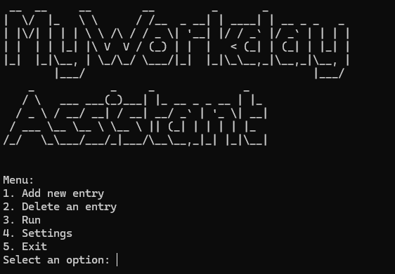

# Requirements
- Python installed
- Firefox

# Coming soon
- Chrome, Edge Compatibility
- More Settings


# Installation
1. Install the Proper Modules
```python
python -m pip install -r requirements.txt
```
2. Run
```python
python ./main.py
```

# Automation
If you want to have this script check your statuses without needing manual intervention run it like this.
```python
python ./main.py --auto_run
```

---
First time running you will need to install the proper driver for Firefox which it will ask you to, once installed everything just run normally.


